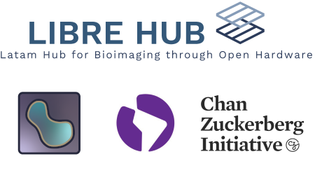

# napari LatAm workshop

[![CC BY 4.0][cc-by-shield]][cc-by] 

This work is licensed openly by Marcelo Leomil Zoccoler, Tobias Wenzel, Juan Nunez-Iglesias, Rocco D'Antuono, Melissa Weber Mendonça, Talley Lambert, Julián Mejía, Adan O. Guerrero Cardenas, and Robert Haase under a
[Creative Commons Attribution 4.0 International License][cc-by] unless mentioned otherwise.  @LIBREhub, @Latin America Bioimaging, @Napari 2023

[cc-by]: http://creativecommons.org/licenses/by/4.0/
[cc-by-image]: https://i.creativecommons.org/l/by/4.0/88x31.png
[cc-by-shield]: https://img.shields.io/badge/License-CC%20BY%204.0-lightgrey.svg

This repository hosts notebooks, information and data for the "Image data science with Python and Napari" remote Latin America workshop in August 2023.

This is the **link to the online jupyter book of the course**: https://librehub.github.io/napari-LatAm-workshop-2023/ rendered from this repository.

It is maintained using [Jupyter lab](https://jupyterlab.readthedocs.io/en/stable/) and build using [Jupyter book](https://jupyterbook.org/intro.html).

## Acknowledgements

This course is held virtually for Latin American participants in August 2023 and with Spanish and Portuguese language support. The workshop is organised by the [LIBRE hub project](https://librehub.github.io/) and is the result of a collaboration and support by a number of individuals and CZI funded initiatives driving access to bioimaging research capabilities, including individuals from [Napari](https://napari.org/stable/), [Latin America
Bioimaging](https://labi.lat/es/), [Mexico Bioimaging](https://meximagingworkshops.org.mx),and available online material. We would like to thank the [Chan Zuckerberg Initiative](https://chanzuckerberg.com/imaging/latin-american-hub-for-bioimaging-through-open-hardware/) for financial support through the [LIBRE hub project](https://librehub.github.io/) and the other participating initiatives. 

This work is forked and modified from a EPFL course developed and licensed by Marcelo Leomil Zoccoler, Johannes Richard Müller, Till Korten and Robert Haase, [PoL Dresden](http://physics-of-life.tu-dresden.de/bia) under a
[Creative Commons Attribution 4.0 International License][cc-by].

