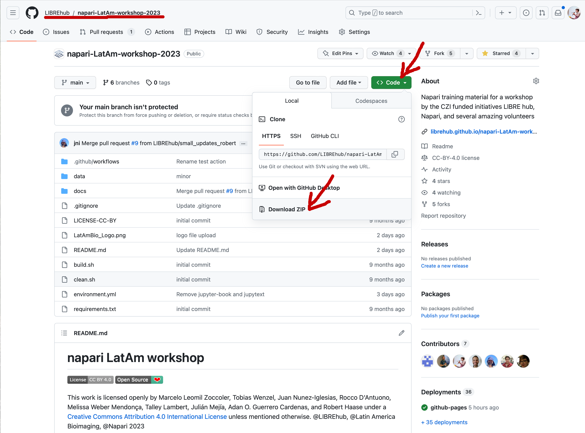

# Image data science for with Python and Napari

A first Latin America workshop #LIBREhub @napari #LABI - Latin America Bioimaging #MexicoBioimaging

This [Jupyter book](https://jupyterbook.org/) contains training resources for scientists who want to dive into image processing with Python and Napari. 
It specifically aims for scientists and students working with microscopy images in the life sciences.
We presume the attendees have some basic python programming and image analysis knowledge. 
To get everyone on the same level, we start with Python programming basics.
We will process images using [numpy](https://numpy.org), [scipy](https://www.scipy.org/), [scikit-image](https://scikit-image.org/), [SimpleITK](https://simpleitk.org/) and [clEsperanto](https://github.com/clEsperanto/pyclesperanto_prototype).
We will explore [Napari](https://napari.org) for interactive image data analysis and the [Napari-Assistant](https://github.com/haesleinhuepf/napari-assistant) for generating [Jupyter Notebooks](https://jupyterlab.readthedocs.io/en/stable/) from interactively designed image processing workflows. 

**Note:** 
Before the course starts, all partcipants are required to have Napari and Jupyter installed, [please see the course preparation page](https://librehub.github.io/napari-LatAm-workshop-2023/day0/pre-requirements/to_be_installed.html) - and make use of the [napari chatroom for troubleshooting](https://napari.zulipchat.com/#narrow/stream/393209-napari-latam-workshop-2023/) if you face installation issues. The session on Python environments is further more in the inverted classroom format, so we kindly ask that you familiarise yourself with the [dedicated teaching material on environments](https://hackmd.io/@talley/SJB_lObBi#Python-environments-workshop) before the session in order to simply use the given time for questions.


## Timetable (subject to adjustments)

All following times are in Chilean (Santiago) time. [Look up your related time here](https://timezonewizard.com/tn-75s), so you don't miss anything.

<style>
.markdown-table {width:100%;}
.markdown-table th, .markdown-table td {border: 1px solid black; border-collapse: collapse;}
.markdown-table th, .markdown-table .special {background-color: #1f497d; color: white !important;}
.bullet {font-size: 1em;}
</style>


### Day 1 - Monday the 7th of August 2023

<div class="markdown-table">

| <div class="special">Time (Chile)</div>     | <div class="special">Activities / Topics</div> | <div class="special">Presenters</div> | <div class="special">Support</div> |
| -------------    |:-------------:| -----:|-----:|
| 08.00 – 09.00 | Motivating talk - Napari bioimage analysis | Juan Nunez-Iglesias | – |
| 09.00 – 09.55 | Welcome and ice-break Session | Tobias Wenzel <br>[slides](https://github.com/LIBREhub/napari-LatAm-workshop-2023/tree/main/docs/Napari_LatAm_workshop_flash-talk_introductions.pdf)| Pierre Padilla Huamantico |
| 10.10 – 12.00 | Environments Q & A <br> installation and set-up | Peter Sobolewski | Marcelo Zoccoler |
| 12:00 - 13:00 | Lunch Break | | |
| 13.00 – 14.55 | Introduction to napari and the napari Assistant <br>Exercise: Export workflow to jupyter notebooks | Robert Haase  <br>[slides pptx](https://f1000research.com/slides/12-937), [PDF](https://github.com/LIBREhub/napari-LatAm-workshop-2023/tree/main/docs/day1/1_introduction_to_napari/Intro_napari.pdf) | Marcelo Zoccoler |
| 15.10 – 16.30 | •	Pitfalls when working with Jupyter notebooks <br>•	Basic types in python <br>•	Lists and tuples <br>• Cropping lists <br>• Cropping images | Marcelo Zoccoler <br>[slides1](https://github.com/LIBREhub/napari-LatAm-workshop-2023/raw/main/docs/day1/3_Python_Introduction/Python_basics.pdf), [slides2](https://github.com/LIBREhub/napari-LatAm-workshop-2023/raw/main/docs/day1/3_Python_Introduction/Python_data_structures.pdf)| Adan Guerrero Cardenas,  <br>Pierre Padilla Huamantico,  <br>Guillermo Sahonero Alvarez,  <br>Jorge Gonzalez |
| 16.30 – 17.30 | •	Masking numpy arrays <br>•	Dictionaries <br>•	Conditions <br>• Loops <br>• Functions | Melissa Weber Mendonça | Adan Guerrero Cardenas,  <br>Pierre Padilla Huamantico,  <br>Guillermo Sahonero Alvarez,  <br>Jorge Gonzalez |
    
</div>

### Day 2 - Wednesday the 9th of August 2023

<div class="markdown-table">

| <div class="special">Time (Chile)</div>     | <div class="special">Activities / Topics</div> | <div class="special">Presenters</div> | <div class="special">Support</div> |
| -------------    |:-------------:| -----:|-----:|
| 10:30 - 11:00 | Questions from the last day? | Marcelo Zoccoler | Tobias Wenzel,  <br>Adan Guerrero Cardenas,  <br>Pierre Padilla Huamantico,  <br>Guillermo Sahonero Alvarez,  <br>Jorge Gonzalez |
| 11.00 – 12.00 | Python advanced folder management with loops <br>• Open proprietary file formats | Marcelo Zoccoler | Adan Guerrero Cardenas,  <br>Pierre Padilla Huamantico,  <br>Guillermo Sahonero Alvarez,  <br>Jorge Gonzalez|
| 12.00 – 14.00 | Introduction to Image Analysis (Presentation) | Rocco D'Antuono | – |
| 14:00 - 16:00 | Lunch Break | | |
| 16.00 – 19.00 | napari/Python Training: <br>• Filters (Smoothing, Edge detection) <br>• Segmentation, Thresholding, Labelling and Measurement | Juan Nunez-Iglesias | Adan Guerrero Cardenas,  <br>Daniel Althviz Moré |


</div>

On the third and last day, there are showcase seminars of key napari plugins as well as emerging trends to controll your bioimaging hardware with python libraries

### Day 3 - Friday the 11th of August 2023 (open to all)

<div class="markdown-table">

| <div class="special">Time</div> | <div class="special">Activities / Topics</div> | <div class="special">Presenters</div> |
| ------------- |:-------------:| -----:|
| 08.00 – 08.20 | Napari Animation | Juan Nunez-Iglesias |
| 08:20-8:50 | Affinder | Juan Nunez-Iglesias |
| 08:50 – 9:30 | Napari Clusters Plotter (Unsupervised machine learning) | Marcelo Zoccoler |
| 09:30 - 10:00 | Break | |
| 10.10 – 11.00 | Napari Zelda (3D segmentation) | Rocco D'Antuono |
| 11.00 – 12.00 | Napari Superres (Superresolution) | Julian Mejia |
| 12:00 - 12:40 | Napari real time processing | Lucien Hinderling |
| 12:40 - 14:00 | Lunch Break | |
| 14:00 - 15:00 | Python libraries for microscope control | Talley Lambert |

</div>


## How to use this material

For following the course, we recommend downloading [the repository from which this Jupyter book is made](https://github.com/LIBREhub/napari-LatAm-workshop-2023).
All Jupyter Notebooks are executable so that attendees can reproduce all demos and exercises.



Assuming you downloaded the repository to your Desktop, you can open the Jupyter book by opening a terminal and typing:

```bash
cd Desktop/napari-LatAm-workshop-2023

micromamba activate devbio-napari-env

jupyter lab
```
If you do not yet have conda or devbio-napari-env installed, first follow the "Course preparation" installation instructions on the next page.

Using Jupyter lab, you can navigate to the course lessons in the `docs` folder.


... and execute the code and experiment with it.


## Feedback and support

If you have any questions, please create a [github issue](https://librehub.github.io/napari-LatAm-workshop-2023/issues).
Alternatively, open a thread on [image.sc](https://image.sc).

## Acknowledgements

This course was held virtually at the [Institute for Biological and Medical Engineering, Universidad Católica de Chile](https://ingenieriabiologicaymedica.uc.cl/en/) in August 2023 as part of the [LIBRE hub project](https://librehub.github.io/). We would like to thank all online contributors and speakers for their support and the [Chan Zuckerberg Initiative](https://chanzuckerberg.com/imaging/latin-american-hub-for-bioimaging-through-open-hardware/) for financial support through the [LIBRE hub project](https://librehub.github.io/). 
We would like to thank all the people who shared teaching materials we are reusing here, in particular from an [EPFL copurse last year](https://github.com/BiAPoL/Image-data-science-with-Napari-and-Python-LatAm2023) and individual contributors including Marcelo Leomil Zoccoler, Tobias Wenzel, Juan Nunez-Iglesias, Rocco D'Antuono, Melissa Weber Mendonça, Talley Lambert, Julián Mejía, Adan O. Guerrero Cardenas, and Robert Haase.


